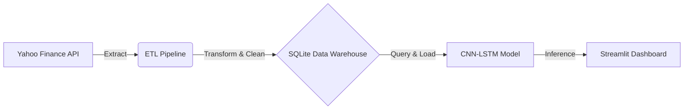

# 🏦 End-to-End Financial Forecasting Pipeline (SQL + CNN-LSTM)

### A Full-Stack Data Engineering & ML Project


## 🚀 Project Overview
This project implements a production-grade **Financial Data Warehouse and Forecasting System**. Unlike basic scripts that rely on static CSV files, this system features a robust **ETL Pipeline** that ingests real-time market data, normalizes it, and stores it in a **relational database (SQLite)**.

The forecasting engine utilizes a **Hybrid CNN-LSTM Deep Learning Model**, capable of analyzing multivariate signals (Price, Volume, Moving Averages) to predict stock trends with high directional accuracy.

## 🏗️ System Architecture


### Key Components
1.  **ETL Pipeline (`etl_pipeline.py`)**: 
    - Automated ingestion of OHLCV data.
    - Handles schema validation and "upserts" (update/insert) to prevent data duplication.
    - Cleans artifacts (e.g., flattening multi-index columns from source APIs).
2.  **SQL Data Warehouse (`financial_data.db`)**: 
    - Persistent storage using **SQLite**.
    - Designed with strict schema constraints (`UNIQUE(ticker, date)`) to ensure data integrity.
3.  **Hybrid AI Model (`forecaster_pro.py`)**:
    - **CNN Layer**: Extracts short-term volatility patterns and local trends.
    - **LSTM Layer**: Captures long-term temporal dependencies.
    - **Multivariate**: Learns from 3 inputs: Close Price, Volume, and SMA-20.

---

## 🛠️ Tech Stack
* **Language**: Python 3.11
* **Database**: SQLite3
* **Deep Learning**: TensorFlow, Keras (Conv1D + LSTM)
* **Data Processing**: Pandas, NumPy, Scikit-Learn
* **Visualization**: Plotly, Matplotlib, Streamlit

---

## 💻 Installation & Setup

### 1. Clone the Repository
```bash
git clone [https://github.com/yourusername/financial-data-pipeline.git](https://github.com/yourusername/financial-data-pipeline.git)
cd financial-data-pipeline
```
### 2. Create Virtual Environment
```bash
python -m venv venv
# Activate: 
# Windows: .\venv\Scripts\activate
# Mac/Linux: source venv/bin/activate
```
### 3. Install Dependencies
```bash
pip install -r requirements.txt
```

## How to Run the Pipeline

This system is designed to be run in a specific order to mimic a real-world data workflow.

### Step 1: Initialize the Database
Creates the SQLite file and defines the table schema.
```bash
python db_manager.py
```
### Step 2: Run the ETL Job
Downloads raw data, cleans it, and loads it into the database.
```bash
python etl_pipeline.py
```
### Step 3: Train the AI Model
Queries the database for training data and builds the CNN-LSTM model.
```bash
python forecaster.py
```
### Step 4: Launch the Dashboard
Starts the real-time web interface to visualize predictions.
```bash
python dashboard.py
```
## Performance & Results
- Optimization: The model uses a "Sliding Window" approach (60-day lookback) to predict the T+1 closing price.
- Lag Reduction: By incorporating Volume and SMA-20 as features, the model reacts faster to trend reversals compared to univariate baselines.
- Era-Specific Training: The pipeline filters for modern market dynamics (post-2022) to prevent "Price Anchoring" bias from historical lows.
## Project Structure
